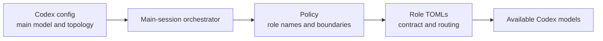

# pilotfish-codex Design Rationale

> pilotfish-codex is an independent Codex CLI adaptation maintained by Miyago.
> Its architecture and orchestration derive from
> [Pilotfish](https://github.com/Nanako0129/pilotfish), whose original design and
> research are credited to Nanako0129. Remora supplies routing data; it is not
> the architectural source of this port.

## Purpose

The primary goal is to preserve Pilotfish v1.2's separation of concerns and
phase-aware orchestration in native Codex configuration. The port keeps
role-based policy, explicit approval boundaries, leaf workers, and
fresh-context verification while replacing Claude-specific mechanisms with
Codex equivalents. The empirical background remains available in the
[upstream research snapshot](./research.md).

The project has its own release line. Future Pilotfish changes are reviewed and
selectively adapted when they improve the Codex design; source parity is not an
independent goal.

## Three-layer translation

Pilotfish separates who orchestrates, which role performs eligible work, and
how delegation behaves because those decisions change at different rates.
pilotfish-codex maps the same design to three Codex surfaces.

| Layer | Codex surface | Owns |
|---|---|---|
| Machine | `~/.codex/config.toml` | Main model, multi-agent enablement, thread cap, and maximum delegation depth |
| Roles | `~/.codex/agents/*.toml` | Role contract, model, reasoning effort, and sandbox defaults |
| Policy | Active global `AGENTS.override.md` or `AGENTS.md` | Phase gates, delegation boundaries, approval, integration, and verification rules |

> **Core invariant:** The orchestration policy names roles but never embeds
> model IDs or reasoning levels. Routing changes in agent TOMLs must not require
> rewriting the policy.

## MultiAgentV2 compatibility boundary

MultiAgentV2 introduces a temporary fourth concern inside the machine layer: a
Compatibility adapter controls how the typed spawn surface is exposed. It does
not own role routing. The stable boundaries are:

| Layer | Owns | Migration stability |
|---|---|---|
| Role TOMLs | Model, effort, sandbox, and role instructions | Stable |
| Orchestration policy | Typed role, task boundary, context budget, and fail-closed behavior | Stable |
| Compatibility adapter | Tool namespace and temporary MultiAgentV2 config | Replaceable |

On affected releases the adapter exposes `agents.spawn_agent` with
`agent_type`. Namespace-specific prose is isolated between transport markers in
the policy template. The rest of the policy names roles without embedding
models, so removing the adapter does not rewrite orchestration semantics.

Support is capability-driven:

| State | Required evidence | Behavior |
|---|---|---|
| `adapter-required` | Typed `agents.spawn_agent` and matching child rollout | Report `ADAPTER_OK` |
| `native-ready` | Adapter-free native typed spawn and matching child rollout | Report `NATIVE_OK` |
| `unsupported` | Neither route proves the installed role binding | Fail closed |
| `not-exercised` | V1 or a prerequisite is unavailable | Report an exact `SKIPPED` reason |

Unsupported named-role routing must fail closed.

Version strings and `codex features list` are hints, because the backend can
select V2 independently of local feature output. The static packaging proof
validates config, policy, and role files without quota. The live routing proof
correlates one parent spawn call to its exact child thread and compares the
child model and effort with the installed role.

Native migration requires a stable Codex release, adapter-free typed
`agent_type`, and a `NATIVE_OK` E2E result. Only the machine adapter and isolated
transport paragraph change. Concurrency support is revalidated separately;
the role TOMLs, bounded-context rule, and fail-closed contract remain intact.
Until Codex exposes safe adapter-free spawn-schema introspection, native mode
returns `SKIPPED` before quota or child creation instead of risking an untyped
probe.

## Seven Codex roles

The Codex roster is the smallest non-overlapping projection of the current
Pilotfish responsibilities.

| Role | Phase | Responsibility | Boundary |
|---|---|---|---|
| `scout` | Discovery | Broad or focused repository reconnaissance | Read-only leaf |
| `plan-verifier` | Plan | Challenge material Plan readiness with `READY` or `REVISE` | Read-only leaf; never rewrites the Plan |
| `security-reviewer` | Plan / Approval | Gather pre-approval security evidence | Read-only leaf; never implements |
| `mech-executor` | Execution | Apply a complete mechanical specification | Leaf writer with no delegation |
| `executor` | Execution | Implement bounded work requiring local judgment | Leaf writer with no delegation |
| `verifier` | Verification | Challenge completed work with `CONFIRMED` or `REFUTED` | Fresh-context leaf; never fixes findings |
| `security-executor` | Execution | Implement an approved security-sensitive contract | Leaf writer with no delegation |

Pilotfish's uppercase `Explore` role is deliberately absent. Its exact name
shadows Claude Code's built-in Explore agent so Claude does not silently inherit
an expensive main-session model. That compatibility mechanism has no purpose in
a Codex-only install, where `scout` already covers both broad sweeps and focused
lookups. Copying both names would create two roles with the same discovery
boundary.

## Phase-aware orchestration

Role matching makes work eligible for delegation; it does not make delegation
mandatory. The main session retains framing, Plan synthesis, architecture,
ambiguity resolution, integration, and final judgment throughout the lifecycle.

| Phase | Stable before delegation | Eligible delegated work |
|---|---|---|
| Discovery | Question, allowed scope, evidence format, and stop condition | Independent `scout` contracts on disjoint evidence surfaces |
| Plan | Outcome, non-goals, dependencies, ownership, sequence, verification, budgets, and stops | Fresh `plan-verifier` challenge |
| Approval | Material Plan is visible and writes are authorized when required | Read-only clarification or security evidence only |
| Execution | Scope, exclusive ownership, constraints, done criteria, integration, and verification | `mech-executor`, `executor`, or `security-executor` |
| Verification | Integrated result is concrete enough to reproduce and refute | Fresh `verifier` challenge |

A delegation-planning layer may choose discovery questions, topology, worker
count, ownership, sequence, budgets, and stop conditions. Pilotfish policy
still owns named-role semantics, the leaf boundary, approval, and verifier
contracts; the role TOMLs own model and effort routing. This composition keeps
planning strategy replaceable without weakening execution safety.

The dispatch brake keeps small or tightly coupled work in the main session. A
single unknown bug should not become a sequential `scout` → `executor` pipeline
when diagnosis, patch design, and live verification share one evolving evidence
chain. Delegation is valuable when lower model cost, preserved main context,
parallel elapsed time, isolated ownership, or fresh independence outweigh
context reconstruction and integration cost.

## Boundaries and routing ownership

The design protects quality by separating questions that should not share an
author or capability surface.

| Boundary | Design consequence |
|---|---|
| Plan readiness vs. completed outcome | `plan-verifier` and `verifier` use different evidence, verdicts, and timing |
| Security evidence vs. implementation | `security-reviewer` remains read-only before approval; `security-executor` writes only after approval |
| Main judgment vs. volume work | The main session owns synthesis and integration; workers receive bounded contracts |
| Parent vs. leaf | `max_depth = 1` and role instructions prevent recursive fan-out |
| Policy vs. routing | Policy uses role names; each agent TOML is the sole source for its model and effort |

Writing agents receive exclusive file ownership or isolated worktrees.
Long-running commands remain in the main session: leaf agents return the exact
command and execution context instead of detaching work that can escape task
tracking.

## Quality through independent verification

Pilotfish protects output quality structurally:

1. The main session produces a complete contract containing the goal,
   constraints, done criteria, rationale, paths, ownership, and verification.
2. Repeated failure changes the boundary: after two attempts, the orchestrator
   escalates, re-specifies, or takes over instead of retrying indefinitely.
3. Non-trivial completed work receives a fresh `verifier` pass that attempts to
   refute the claimed outcome with independently reproduced evidence.

The verifier is intentionally different from the executor. It never fixes a
finding, and `CONFIRMED` means the completed-work claim survived a fresh
challenge rather than merely repeating the implementer's test report. Scout
findings remain discovery evidence; any single fact that carries a decision is
sanity-checked separately.

## Routing reference

Remora 0.1.10 is used only to choose the GPT-5.6 model and reasoning-effort
bindings for the seven shared roles.

| Role | Model | Reasoning effort |
|---|---|---|
| `scout` | `gpt-5.6-luna` | `low` |
| `plan-verifier` | `gpt-5.6-sol` | `medium` |
| `security-reviewer` | `gpt-5.6-sol` | `high` |
| `mech-executor` | `gpt-5.6-luna` | `medium` |
| `executor` | `gpt-5.6-luna` | `max` |
| `verifier` | `gpt-5.6-sol` | `high` |
| `security-executor` | `gpt-5.6-sol` | `max` |

The recommended main model is Sol, but the installer leaves the user's
main-session reasoning effort unchanged. This keeps Pilotfish's architecture
stable while allowing the routing table to evolve independently.
